Most of this tutorial will be devoted towards learning about Xcode. In this section, we'll have our first introduction to Xcode and go through the process of creating a new Xcode project for our app.

## What is Xcode?

Xcode is an _Integrated Development Environment_ (IDE) for developing apps in the Apple ecosystem. We'll be focusing on iOS apps, but you can also make apps for macOS, watchOS, and tvOS apps. IDEs (like Xcode) contain and integrate many powerful tools that make software development easier for programmers.

As you learn to build apps in Xcode, you'll use many of these tools. Tools that you'll use commonly on a daily basis might include:

- **Source Code Editor:** write and edit code
- **Interface Builder:** build and visualize user interfaces (UI) without code
- **Debugger:** test, catch and debug problems in your code
- **Compiler:** helps you find mistakes in your code and offers "Fix-its" suggestions
- **Assistant Editor:** edit multiple files in Xcode side-by-side
- **Simulator:** test and run your app on a simulated iPhone on your computer

We'll go through each of these tools more in-depth as we build our Magic 8-Ball.

> [info]
Remember, Xcode contains many more tools that the ones listed above. In this tutorial, we limit our focus to learn about only the most important Xcode tools for building simple iOS apps.

# Your First Xcode Project

Firsts are always special. Now that we know a little more about Xcode, we'll begin by creating our _first_ Xcode project.

Get familiar with this process! You'll repeat it over and over whenever you start a new app.

> [action]
Create a new Xcode project:
>
1. Open _Xcode_ on your computer. You should see the following launch window after you open Xcode 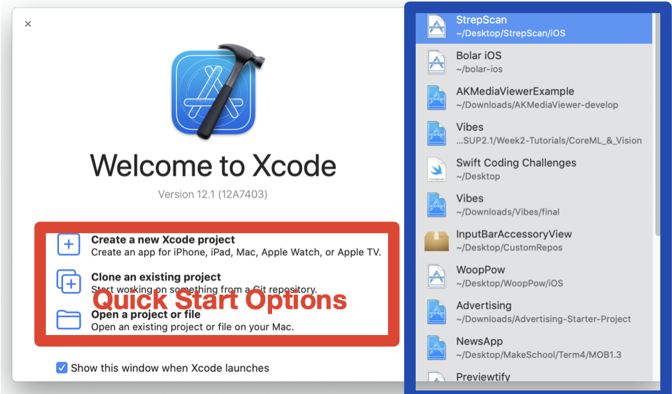
1. Next, from the launch window's quick options click `Create a new Xcode project` 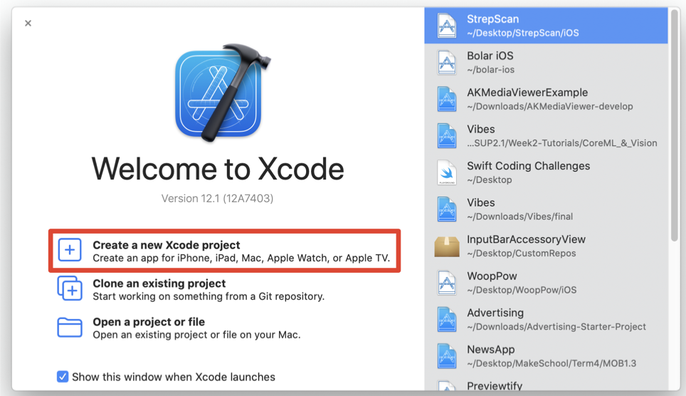
1. You should see the following prompt to select a template for your new project. Under _iOS_, select _Single View App_ 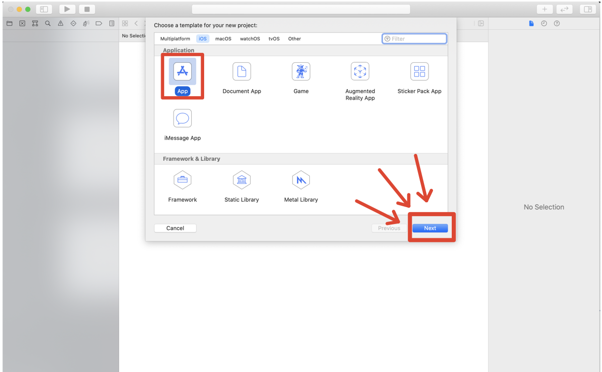
1. With your selected template, click _Next_. You should see a new prompt for your project details 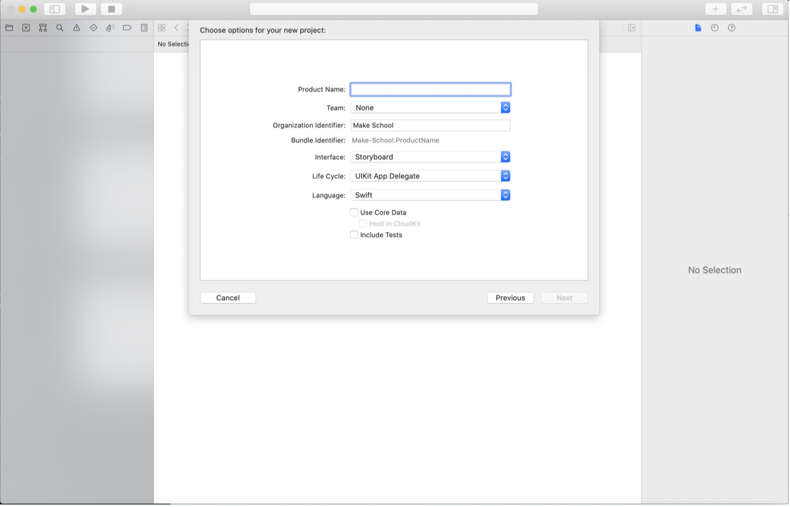

In this new prompt, we'll set some basic info and details that Xcode needs to create a new project.

> [action]
In the project details prompt, enter the following information:
>
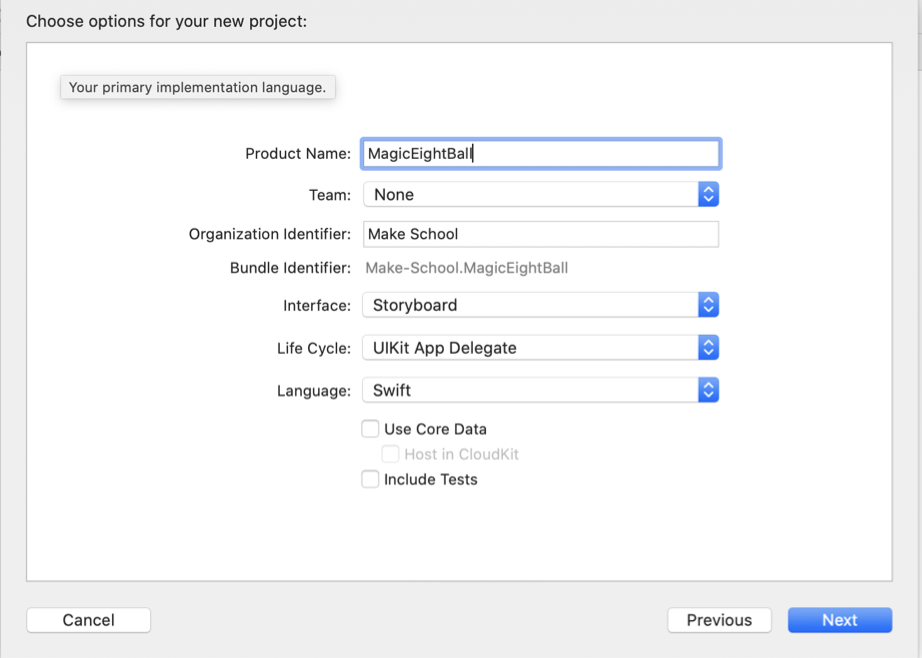
>
If you need a step-by-step breakdown:
>
1. In the _Product Name_ field, enter `MagicEightBall`. This is what Xcode will name your project in your file directory. To prevent potential name-related problems, it's best to stick with alphanumeric characters (letters and numbers) and avoid special characters.
1. In the _Team_ dropdown menu, set it as `None`. If you already have an `Apple Developer Team`, you can select that instead.
1. In the _Organization Name_, you can enter one of the following: your name, your fake company name, or _Make School_.
1. In the _Organization Identifier_, set it as _com.makeschool_. If you own a domain name, you can set this field as your reverse domain name. For example, if you own the domain name _happycarrot.com_, you would put _com.happycarrot_ as your identifier.
1. The _Bundle Identifier_ will be automatically generated from your _Organization Identifier_ and _Product Name_. Apple uses the bundle identifier to uniquely identify each app in the _App Store_.
1. In the _Language_ dropdown menu, make sure it's set to `Swift`.
1. Finally, leave all three checkboxes unchecked. We won't use _Core Data_ or testing in this tutorial. Those are more advanced topics we'll cover at another time.

<!-- break -->

> [action]
To finish up and create our new project:
>
1. After filling out your project details above, click _Next_. 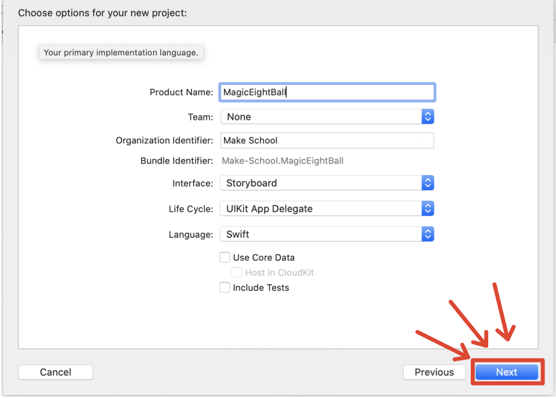
1. Xcode will now prompt you to select where you'd like to store your project. Using the file navigator, choose to a place on your computer to store your project. If you don't have a place in mind, you can use your `Documents` folder. 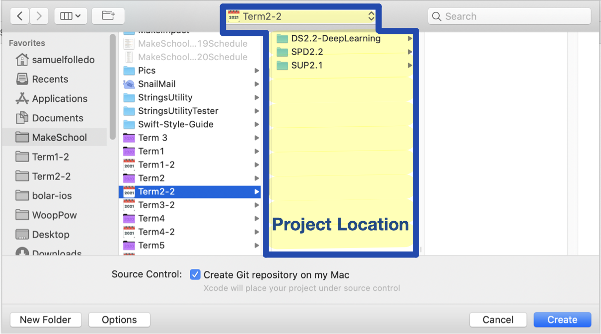
1. Make sure you keep the _Source Control_ checkbox selected for _Create Git repository on my Mac_. 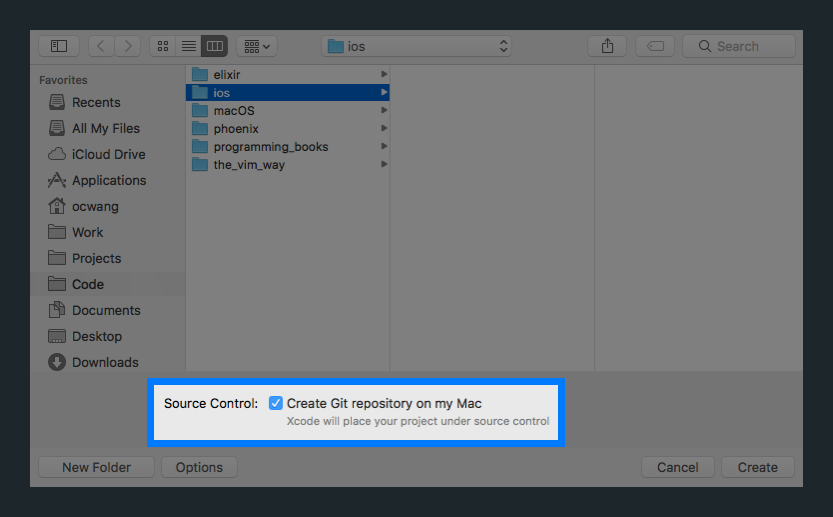
1. After you've selected a project location and verified that the _Source Control_ checkbox is selected, click the `Create` button. 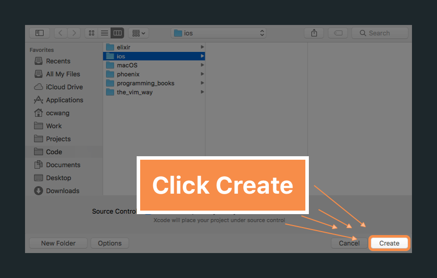

Congrats! Meet your first new project. You should see the following:

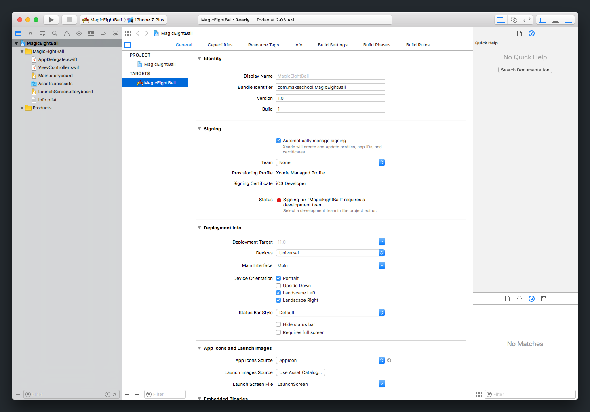

Can you feel the sparks? I think this is the start of something special.

# Getting To Know Xcode

As we build our Magic 8-Ball app, we'll learn about Xcode and how to harness it's power. Before moving onto the next section, we'll go over a brief overview for each of the main areas of Xcode and how to run our newly created app in the simulator.

Picking up where we left off, you should see something similar to the following:

Woah! At first glance, you'll notice there's a lot going on. Tabs, buttons, panels and text fields everywhere!

If you feel overwhelmed, take a deep breath. We'll walk through this together.

## Xcode Main Areas

Xcode is broken down 4 main areas + a toolbar:

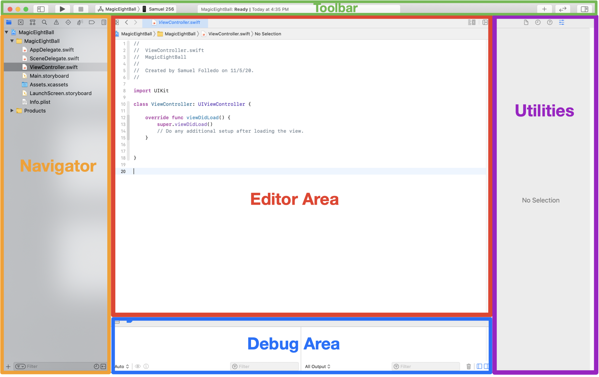

Here's a quick breakdown of each of the areas above:

1. **Toolbar (Green):** displays key information about project, expand/collapse other areas, run project
1. **Navigator (Orange):** find files, search in your project, manage source control, navigate errors
1. **Editor Area (Red):** write code, build UI with storyboard, change project settings
1. **Utilities (Purple):** gives info about files, set properties of items in Interface Builder
1. **Debug Area (Blue):** test and debug your code at runtime

Each area has many more tools and features built-in, so don't think of the summary above as a comprehensive list. We've just highlighted the key functions of each part of Xcode.

## The Toolbar

The Xcode toolbar provides easy access to information and buttons that you'll use often. You can see it at the very top of your Xcode IDE: 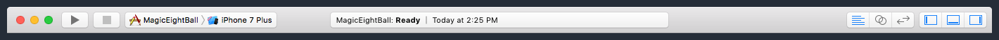

Let's go over some of the most important parts of the toolbar and figure out how to run our app.

## Xcode Status Bar

In the center of the toolbar, you'll see the Xcode status bar:

The status bar provides helpful information about your project. It'll change and update as you use Xcode.

For example, if Xcode finds warnings or errors when it _builds_ (more on this soon) your project, it'll display it in the status bar. You can see this below:

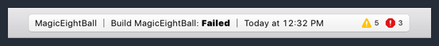

Notice the yellow warning icon and the red error icon on the right side of the status bar.

## Showing / Hiding Xcode Areas

You can also hide and display the _Navigator_, _Debugger_ and _Utilities_ based on which tools you're using at the moment. This can be done by toggling the 3 buttons shown below:

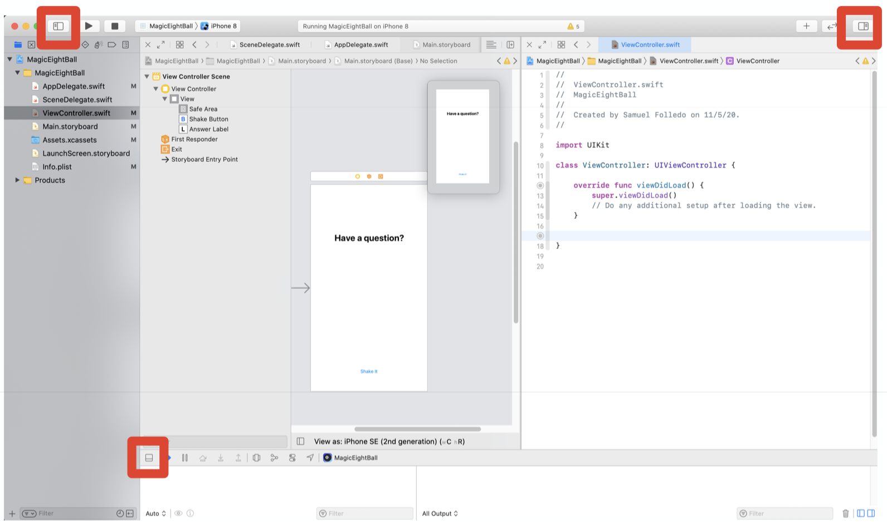

If your computer doesn't have a large screen, it's often helpful to hide these areas when you're not using them so you can focus on the areas you are using. We'll see this in action later in the tutorial.

# Running Our App

Let's go through the process of running our app on the simulator.

> [info]
We're specifically using the iPhone 8 simulator for convenience right now. In the future, you can use any simulator of your choice or even your own device.

Take a look at the group of buttons on the left-hand side. You should see:

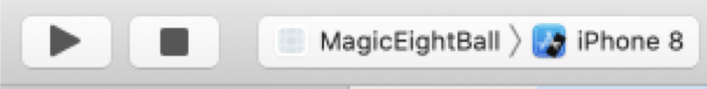

These buttons and controls allow you to _build_ and run your app on either a simulator or your iPhone.

> [info]
**What is the build process?**
>
The build process, also referred to as building, is the series of tasks that must be completed in order to turn your code into an app that can be run on a device (or simulator).
>
One of these tasks is _compiling_ your code. This means that the compiler turns your Swift code into machine-code (instructions that your computers can read). During this process, the compiler may find errors with your code. If it does, the build process will fail and Xcode will display the errors in the status bar as shown previously.

## Scheme Dropdown

The _Scheme_ dropdown menu will allow you to edit and manage multiple _schemes_. A _scheme_ tells Xcode **what** to build and run when you press the _Run_ button. As a beginner, you don't need to worry about dealing with multiple schemes.

The second half of the scheme dropdown allows you to specific a simulator or device that you want your selected scheme to run on. For us, we want to run our app on an _iPhone 8_ simulator.

Click on the right-side of the _Scheme_ dropdown to see a full list of options. If you connect your iPhone to your computer, you'll see your device show up as an option as well.

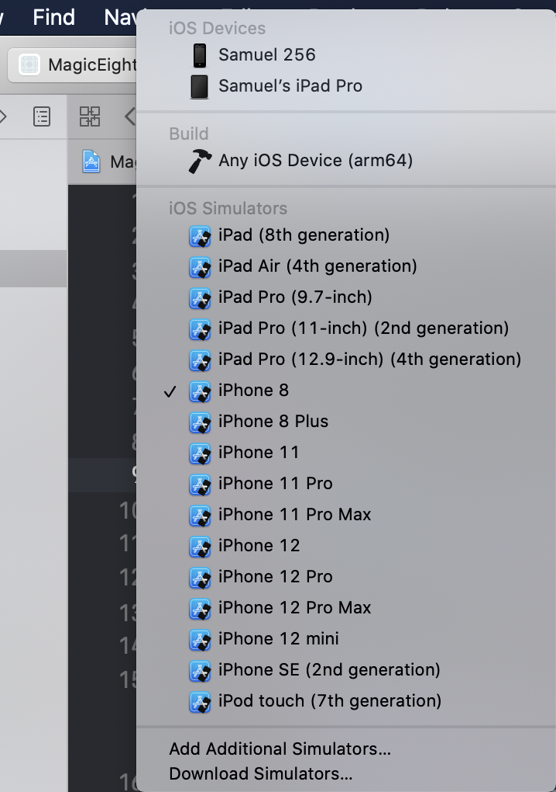

Let's change the device our scheme will run on.

> [action]
Change your scheme to build and run on the _iPhone 8_ simulator. Click on the second half of the scheme dropdown menu and select _iPhone 8_ simulator.
>
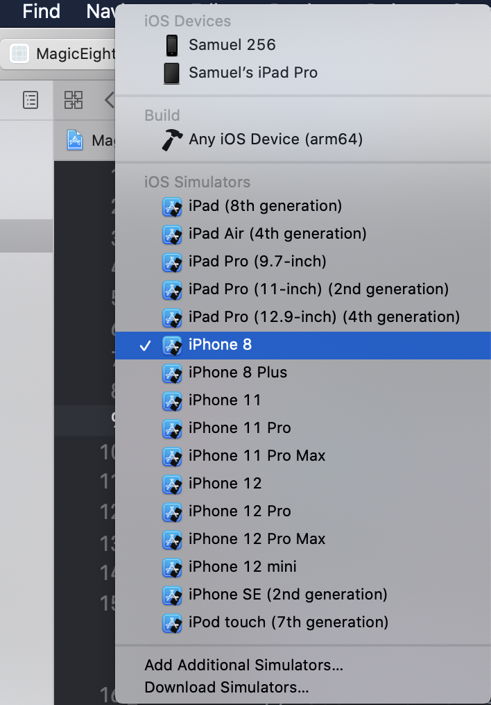

With our simulator set, we can move on to build and run our project.

## Run Button

If you haven't guessed already, the _Run_ button will build and run your active scheme on the selected device. Since we selected the _iPhone 8_ simulator in the previous step, our app will run on the iPhone 8 simulator.

> [action]
Click the _Run_ button now and watch Xcode build and run your empty project. In the future, you can also use the keyboard shortcut command-r (`⌘R`) to run your project.

<!-- break -->

> [info]
The first time you run your app, you may see a dialog that asks for your password: 
>
Enter and click `Continue`. This permission is necessary to run your app using the _debugger_ (more on this later).

If all goes well, you'll see a simulator with your app launch:

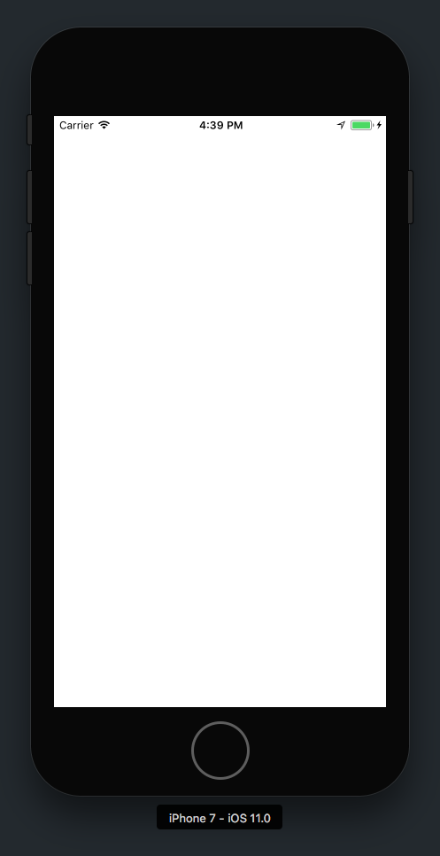

If you're wondering why there's just a blank white screen, it's because we haven't added anything to our app yet. As we develop our app, we'll see the changes and functionality appear when we run our app.

## Stop Button

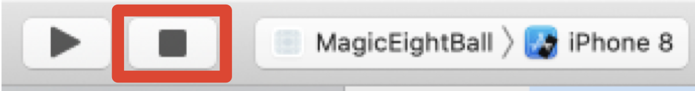

The _Stop_ button (looks like a square) will stop the instance of your app if it's currently running.

> [action]
Click the _Stop_ button to terminate the running instance of your app on the simulator. For future reference, the keyboard shortcut command-. `⌘.` will stop your app.

You'll see that the simulator will stop running your app.

## Progress So Far

At this point, you've created your first Xcode project and run the empty new project in the simulator. As we move forward, we'll keep running our app on the simulator to check that our project is working as expected.

Next, let's we'll learn about the _Project Navigator_, the different type of files in Xcode and how to add an app icon to our project!
