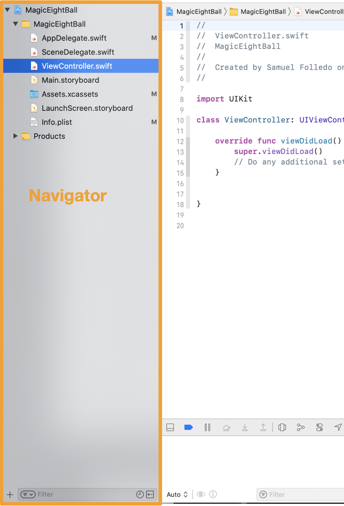
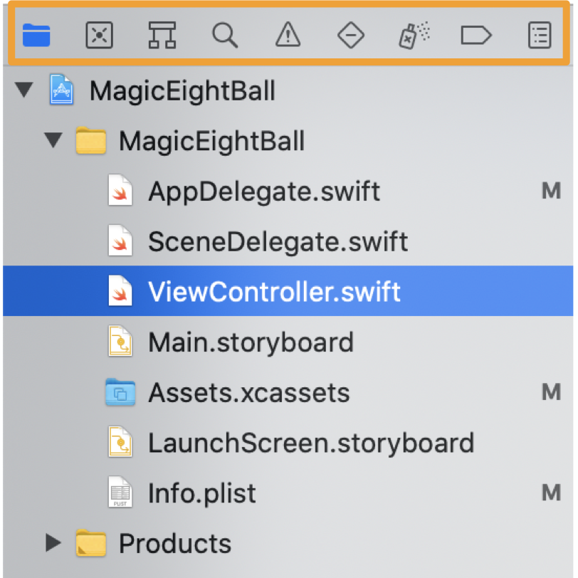
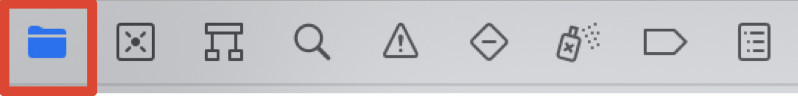
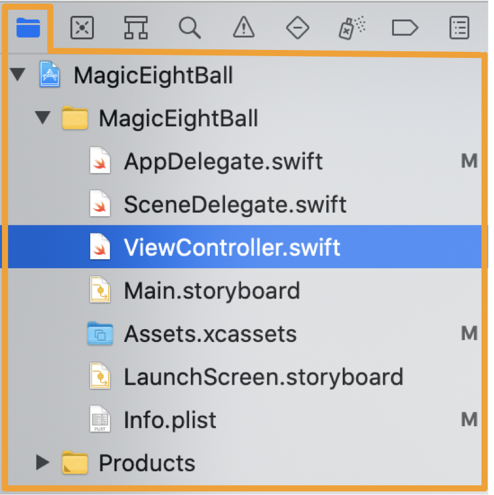
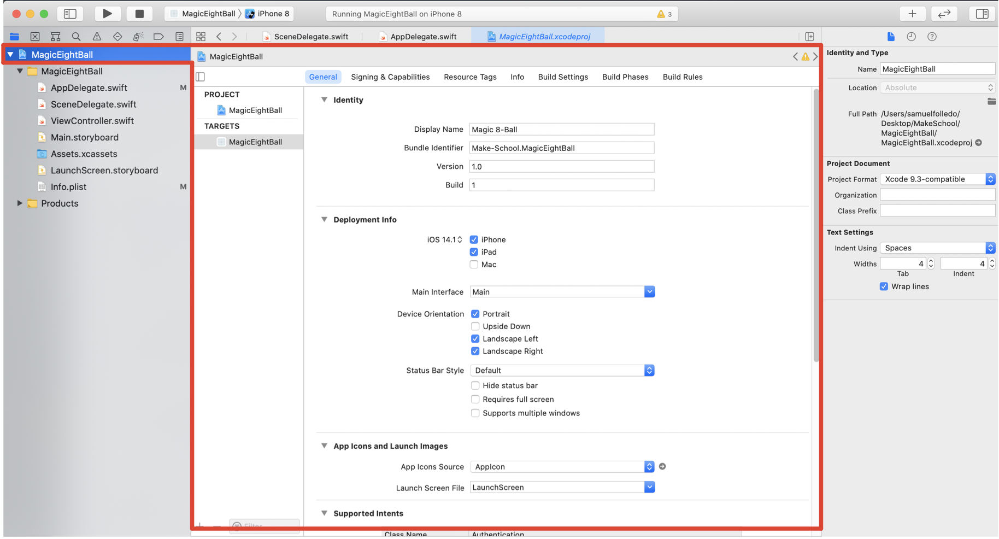
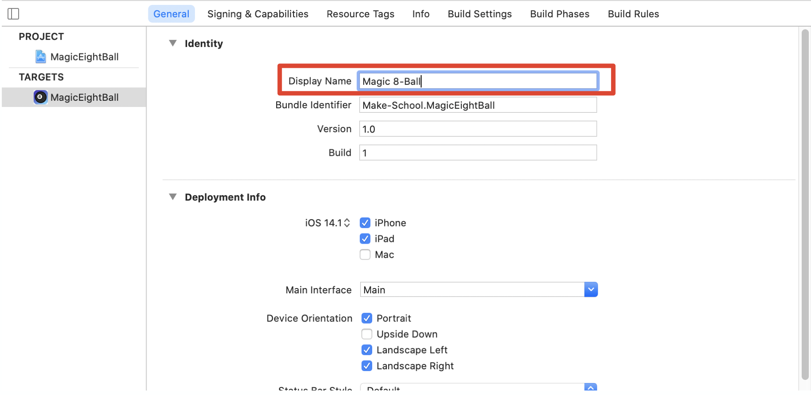
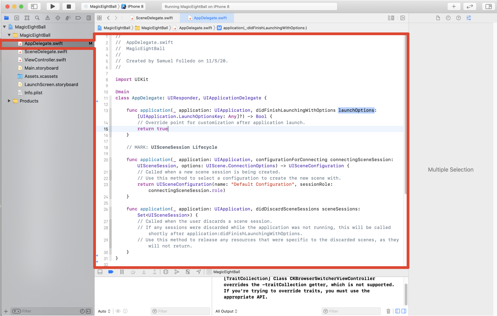
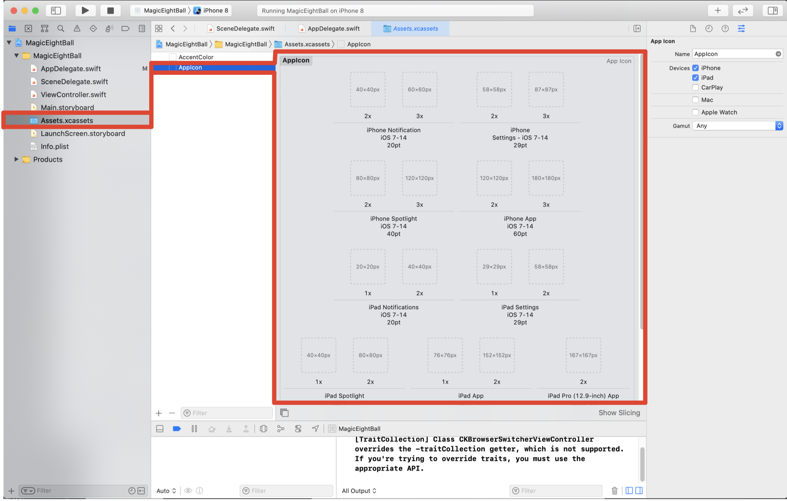
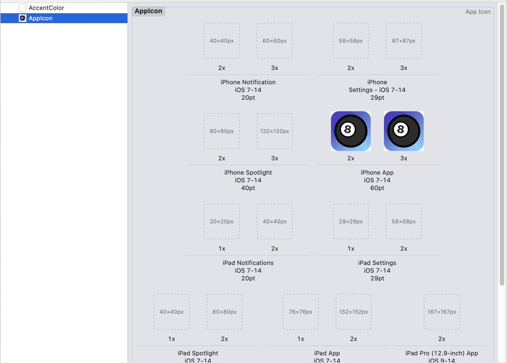
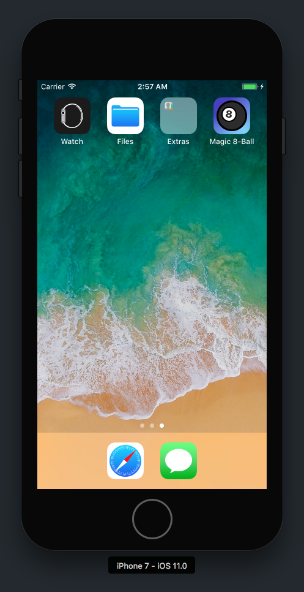

Let's take a look around our newly created Xcode project. All of the files and settings in our current Xcode project are the default configurations when a project is created from the _Single View App_ template.

To see what's in our project and navigate file to file, we'll need to using the _Navigator_.

## Navigator

The navigator pane contains multiple tabs (call navigator) for many different tools in Xcode.

You can change tabs by clicking on the different icons at the very top of the navigator pane.

Each of these navigator tabs are useful tools that you'll eventually learn to use. Some of the most important ones are:

- _Project navigator (folder icon)_: navigate and change files
- _Find navigator (magnifying glass icon)_: search through your project to find files
- _Issue navigator (warning sign icon)_: locate and fix warnings and errors in your project

In this tutorial, we'll only focus on the first tab, the _Project navigator_, but you'll learn about all of them eventually.

<!-- include issues navigator? -->

## Project Navigator

The project navigator helps you navigate and organize your project files. In other words, it makes it easier to find and open different files in the same project.

> [action]
In your Navigator pane, make sure you have the project navigator tab active. If you don't, click on the first navigator tab. It has an icon that looks like a folder. 

With your Project navigator tab active, you should see your project's files right below the Navigator tabs:

Let's look at some of the different files in our project.

# Xcode Project File

> [action]
In the navigator, select the Xcode project file at the very top of the project navigator. You should see the following:
>

<!-- break -->

> [info]
You'll notice, whenever you choose a file in the _Project navigator_, the _Editor area_ will update with the corresponding file. In addition, the _Utilities area_ will also change to match the options available for the active file. Switch back and forth between a couple files if you want to test it out (using a single click NOT double click).

In the project details, you can configure your app's settings. For example, let's go through the process of changing the app's name that is displayed on the home screen of a user's iPhone.

> [action]
To get a better idea of what we're changing, run the app on the iPhone 7 simulator. You'll see the blank white screen as you saw earlier.
>
Next, press command-shift-h (`⇧⌘H`). This will take you to the home screen of your iPhone 7 simulator.
>

As you can see above, the app icon is the default blank app icon that comes with new projects. In addition, our project name is by default the product name that we set when creating the project. We'll eventually change both, but first let's change the app's _Display Name_.

Back in Xcode, we can change the app's display name by editing the _Display Name_ field in our project details. Make sure the Xcode project file is active in your Project navigator.

> [action]
Set the app's display name from the default `MagicEightBall` to `Magic 8-Ball`.
>

Done! That was easy.

Before getting to changing the app's icon, let's take a look at some other types of files.

# Swift Source Files

In your Project navigator, select the file nested under your Xcode project file named `AppDelegate.swift`.

Files with the `.swift` extension are Swift source files. The code you write will be in Swift source files.

The _App Delegate_ is an important object that is responsible for handling your app lifecycle. If you look at the some of the method names in the file, you'll see names like:

- `application(_:didFinishLaunchingWithOptions:)`
- `applicationWillResignActive(_:)`
- `applicationWillTerminate(_:)`

As you can guess, all of these methods happen when your app changes _state_ such as when your app first launches, when it's put into the background, or when it's terminated. Although we won't add anything in here for this tutorial, you can add code here to customize your app behavior when important app lifecycle events happen.

# Asset Catalog

Now, let's get back to changing our app icon.

> [action]
From the Project navigator, select the `Assets.xcassets` file. Within the editor area, you'll see a single asset placeholder named _AppIcon_. Normally, you'll see a list of all your app's assets in the _Asset Catalog_.
>
In your Asset Catalog, select the empty _AppIcon_ placeholder asset. You will see a bunch of empty placeholders for your app icon in multiple different sizes and devices.
>

If you're wondering why there are so many empty app icon placeholders, it's to support different resolutions and sizes of different devices.

For our Magic 8-Ball app, we'll only add the app icon images to be displayed on the home screen. When you're really submitting your app to the App Store, you'll need to make sure to account for all the relevant app icon sizes.

> [action]
Go ahead and download the Magic 8-Ball app icon images by [clicking here](https://github.com/MakeSchool-Tutorials/Magic-8Ball-Swift4/raw/master/magic_app_icon.zip). After downloading and unzipping your image assets, drag and drop the `app_icon@2x.png` into `iPhone App iOS 7-11 60pt 2x` empty placeholder. Repeat and do the same for `app_icon@3x.png` with `iPhone App iOS 7-11 60pt 3x`.

When you're finished, your _AppIcon_ image set should look like the following:

You've successfully added a custom app icon to your Magic 8-Ball app!

> [info]
After adding your Magic 8-Ball app icon, you'll notice some new warnings appear. These appear because our Xcode project is expecting additional version of our app icon for the App Store and the iPad device. It's ok to ignore these warnings for this tutorial.

# Testing Our Changes

To make sure our changes have worked, let's run the app. Remember, we haven't changed what the app does, so when we run the app it'll still be a blank, empty white screen.

> [action]
Run the app by pressing the Run button in the toolbar or the `⌘R` shortcut. With the app active in the simulator, press command-shift-h (`⇧⌘H`). You should see the simulator return to the iPhone home screen with your new app icon and display name!
>

