Up to this point, we haven't done anything that changes what our app will do when it's run. As we can see from running our app in the simulator, it's still just an empty, blank white screen.

In this section, we'll build the UI for our Magic 8-Ball.

> [info]
**What is UI?**
>
User interface, commonly referred to as UI, are any elements that your app will display on screen to a user. This includes visual elements like text and images as well as interactive elements like buttons, sliders and tabs. In programming, it's also common to refer to UI as your _views_.

## Introducing View Controllers

If you're planning to build iOS apps, you'll need to learn about the `UIViewController`. View controllers are one of the fundamental building blocks of iOS development.

The `UIViewController` is a class that is responsible for _controlling_ its set of _views_. Each view controller has a root view that acts as a canvas to place other subviews.

<!-- can consider adding jump to definition here for UIViewController view property -->

As you can see above, both the text label and button are subviews placed on top of the view controller's root view.

As a beginner, you can think of each screen of your app as a view controller. All buttons, text, images are _subviews_ that the corresponding view controller object controls. If the user taps a button, the view controller will be responsible for what happens.

> [info]
Although we'll only use a single view controller in this tutorial, you can have any number of view controllers in your app.

Next, let's build our UI in the default view controller that comes with every _Single View App_ Xcode template.

# Adding UI in Storyboard

First we'll need to open our storyboard file.

> [action]
In your Project navigator, select the `Main.storyboard` file. You'll see your editor area change to the following:

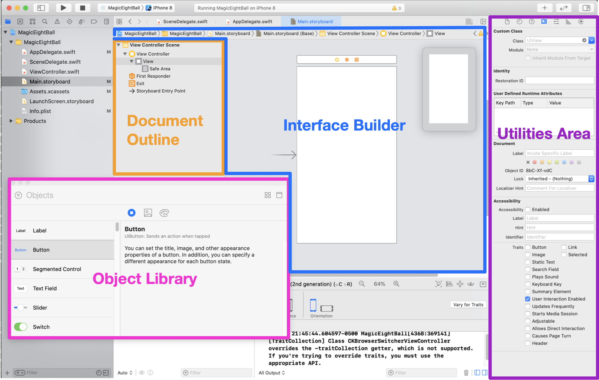

Each of the highlighted areas is important to building your UI in your Main storyboard file:

- Document Outline (Orange): displays a vertical view hierarchy of your storyboard file
- Interface Builder (Blue): displays a visual representation of what your UI will look like
- Utilities Area (Purple): configure properties, size, and other details of your storyboard elements
- Object Library (Pink): displays a list of all Apple's pre-built UI components you can use in storyboard

If you can't see your object library, click on the `+` button on top of your __Utilities Area__. However, I personally prefer using a shortcut to show your object library: `command` + `shift` + `L`

Now let's add our Magic 8-Ball _Shake It!_ button to our view controller.

> [action]

>
Find the `Button` object in the _Object Library_ and drag and drop it onto the root view of your view controller.

Next, let's learn more about the _Utilities area_ so we can configure our button to have the right title text.

# Utilities Area

Just like the _Navigator_, the _Utilities_ pane has multiple different tabs at the top called inspectors.

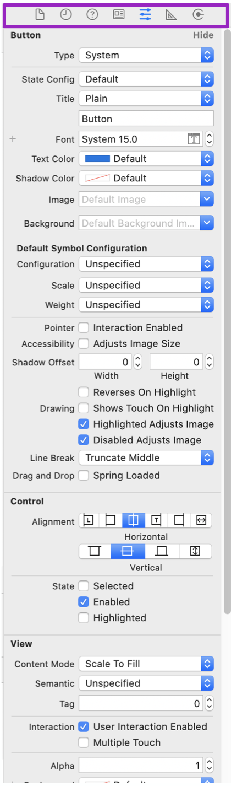

The tabs are contextual based on what is actively selected. That means that the tabs in the _Utilities area_ will change based on whatever you last clicked in Xcode.

Each inspectors allows you to configure different details and attributes about the selected item.

## Attributes Inspector

First we'll look at the _Attributes Inspector_ which changes the attributes of a selected storyboard object. We can use this to change the title of our button.

> [action]
>
1. Make sure you click on the button and that it's actively selected. Remember the _Utilities_ pane is contextual so it will change based on what is selected. 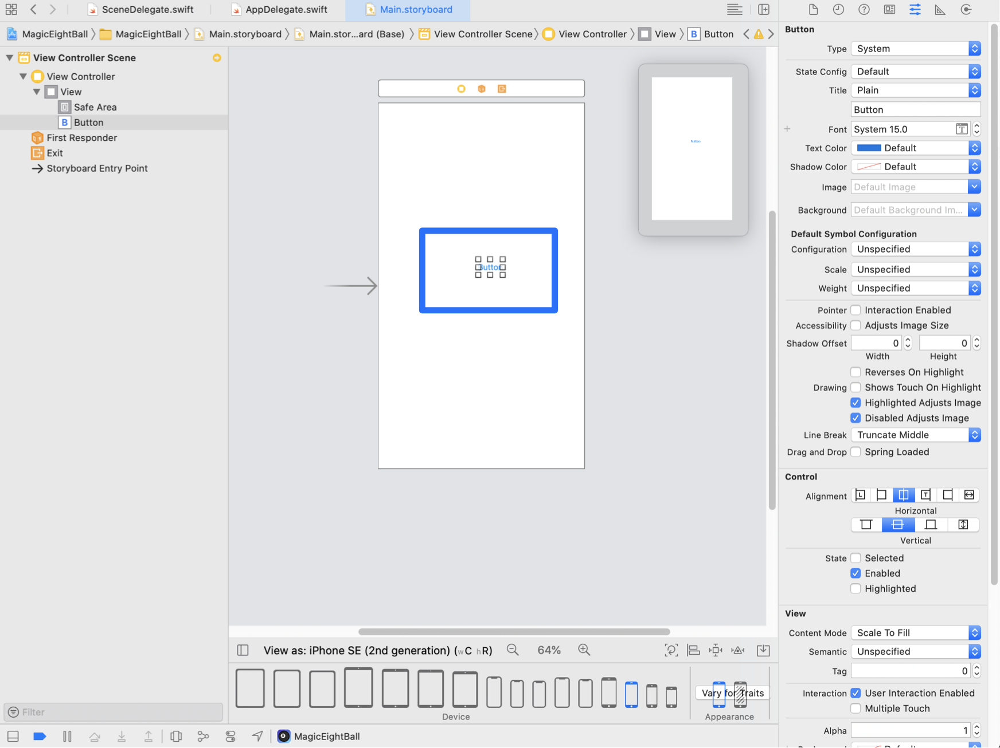
1. Next, navigate to the _Attributes Inspector_ tab in the _Utilities area_. It is the 5th icon from the left. 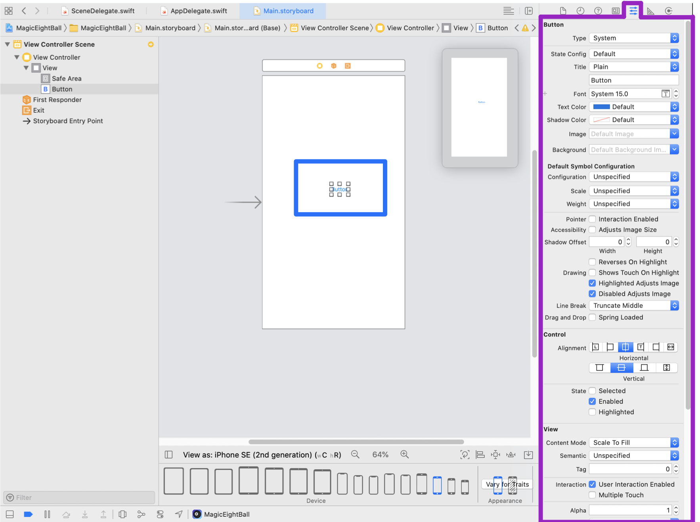
1. Last, find the title field and change it from the default text `Button` to `Shake It!`. 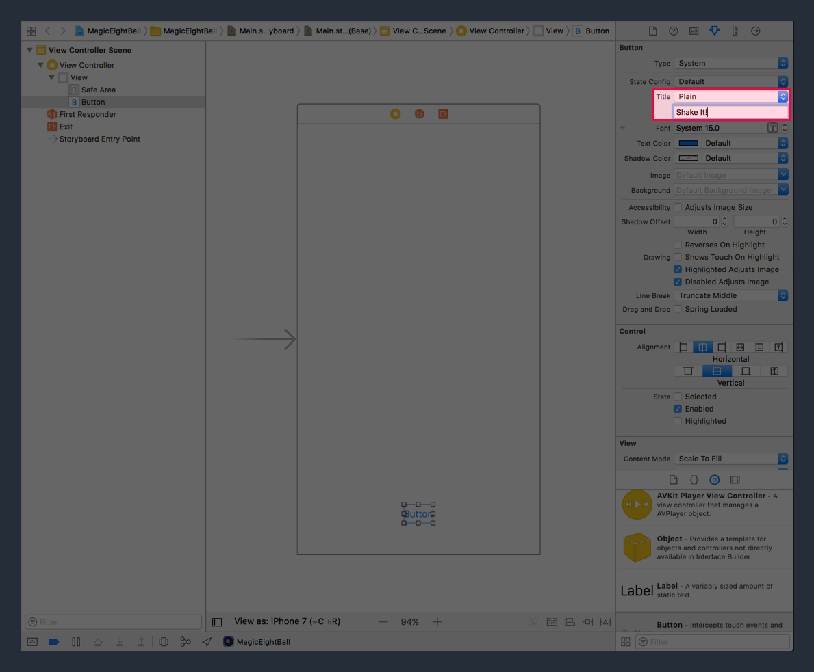

You should now see a squished button with the `Shake It!` title.

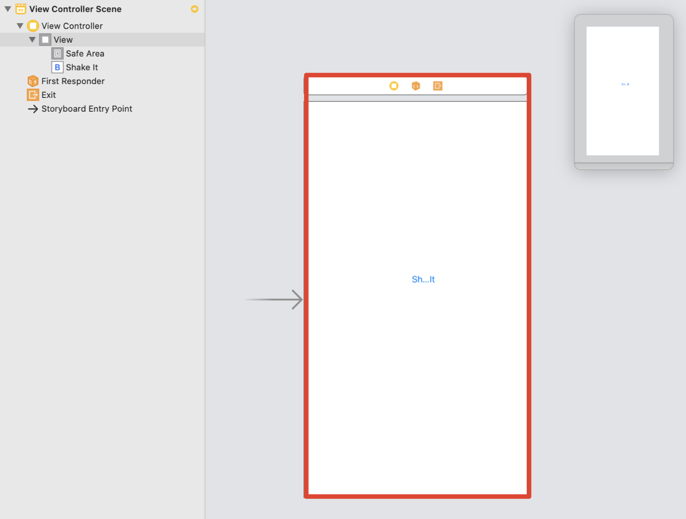

We'll fix this next using the _Size Inspector_.

## Size Inspector

Right now our shake button is squished because the new title text is longer than the width of the button. To fix that we'll change the _frame_ of the button.

The _frame_ of an object refers to a object's X and Y position and it's size (height and width).

We can view our current skip button's frame in the _Size Inspector_.

> [action]
First, navigate to the _Size Inspector_ in the utilities area. 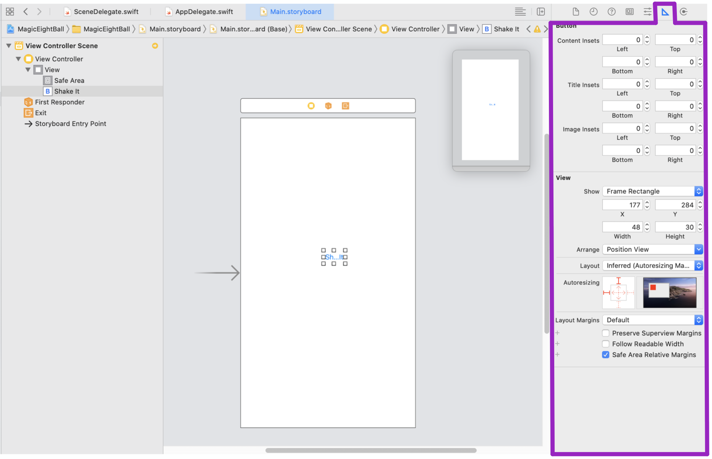
>
You can view and edit the current frame of the selected storyboard object under it's _View_ section. 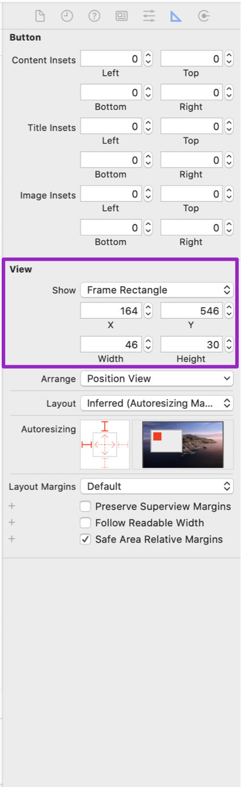

A simpler, but less precise way of changing our button's frame is by selecting it your cursor and dragging. You can drag the center of the object to move as well as the corners of it's bounds to resize it.

> [action]
Change your skip button's frame to be centered and positioned along the bottom of the Interface Builder view controller.
>

The positioning doesn't have to be perfect, but if you want to be more precise you can use the _Size Inspector_.

> [info]
In this tutorial, we'll be setting a pre-defined frame for each of our subviews. That means that if the user is using a simulator or iPhone with a different screen size, our UI will be incorrectly sized.
>
This is ok _for now_. This tutorial is more focused on making sure you get a lay of the land with Xcode and iOS development. In the next Tip Calculator tutorial, you'll learn about using tools like auto-layout and stack views to create dynamically re-sizable views.

# Adding a Label

To complete our UI, we'll also need to add a label to display the Magic 8-Ball's answers.

> [action]
From the _Object Library_ find the label and drag it onto center of the view controller's root view.
>

Next, we'll change the size and attributes of our label.

> [action]
>
1. Select the label and open the _Attributes Inspector_ in the _Utilities area_. 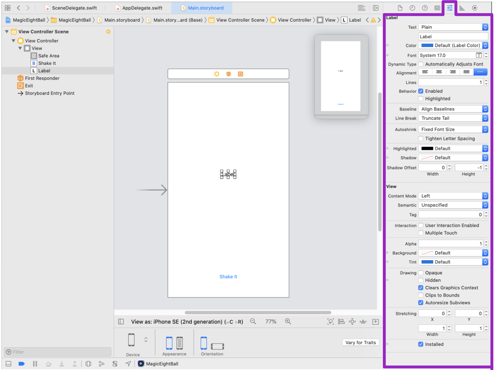
1. Change the `Text` attribute from the default `Label` placeholder to `Have a question?`. This will be the new default text that the app starts with every time the app is opened. 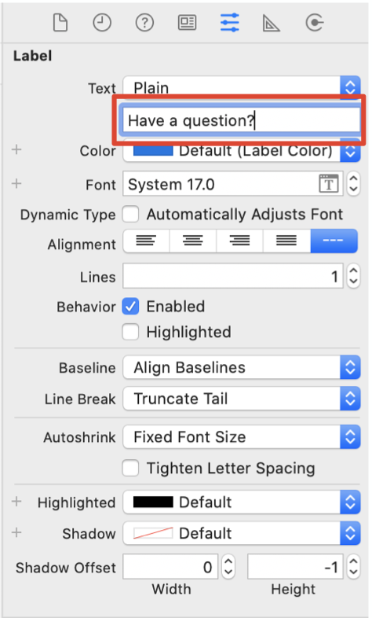
1. Resize the label so that it fits the new text. 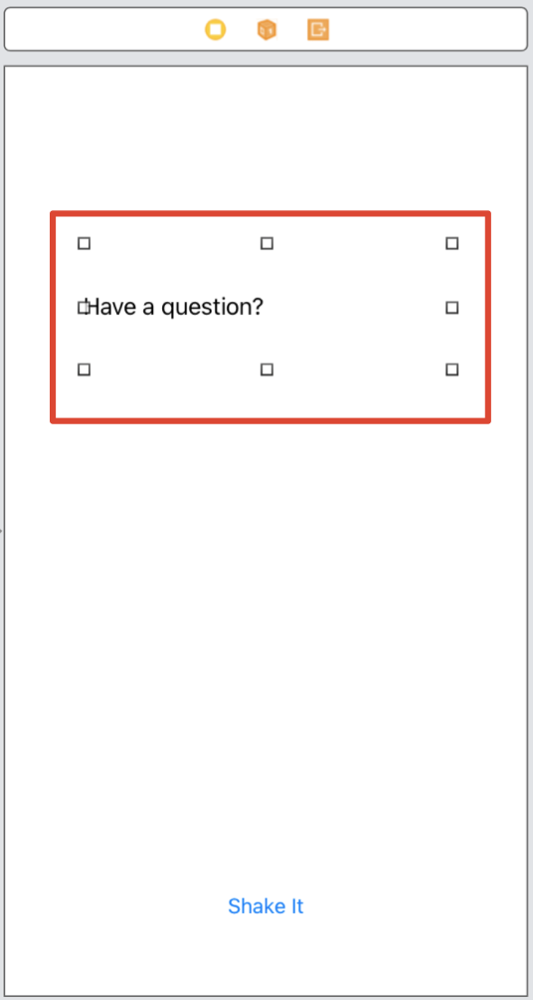
1. In the _Attributes Inspector_ change the text alignment to _Center_. 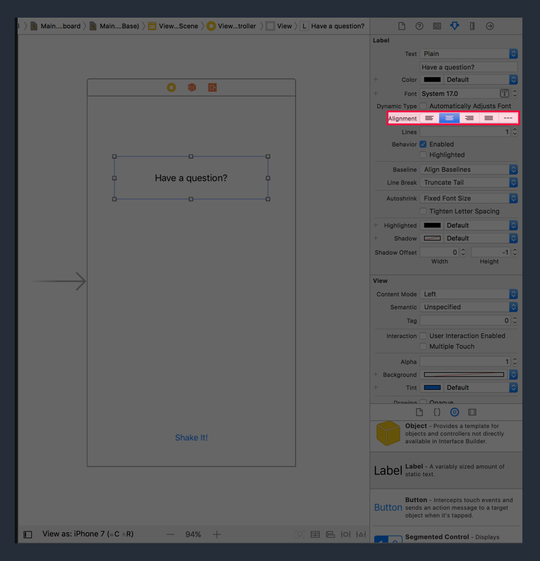
1. Last, change the _Font_ attribute from `System 17.0` to `System Bold 28.0`. 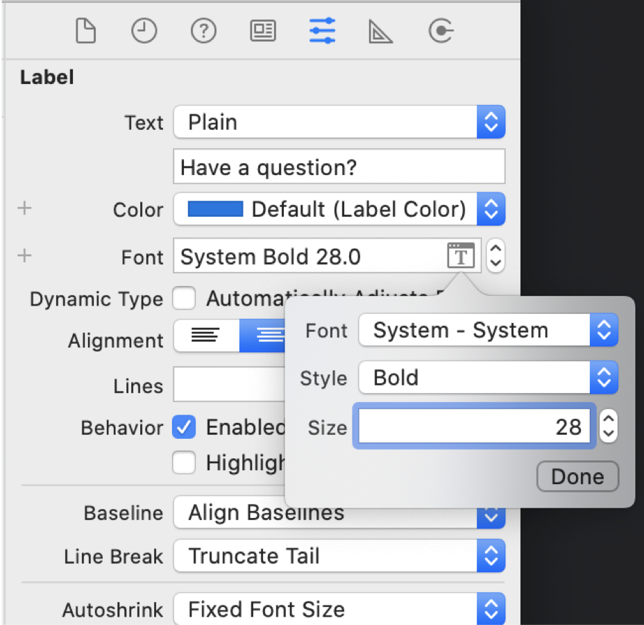

We've just finished setting up the UI for our app. Let's take a second to build and run to see our progress.

> [action]
Build and run your app on the iPhone 8 simulator. You'll see the following:
>
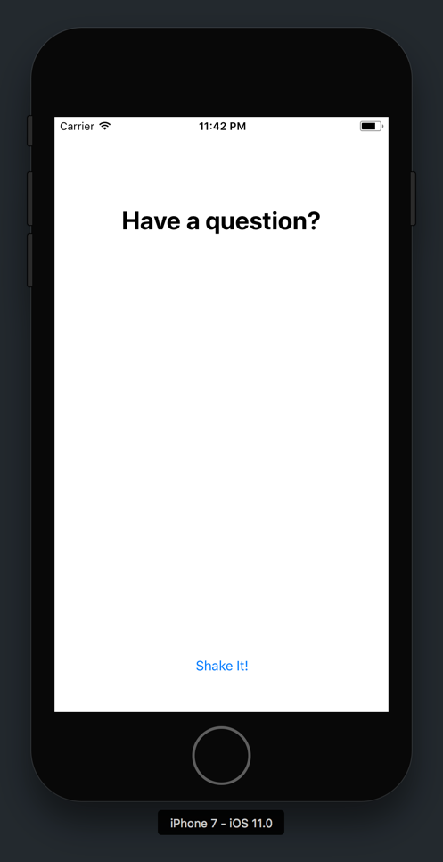

We've laid out our UI using Interface Builder. Next, we'll look at connecting our views to our Swift source files. As you might imagine, without connecting our storyboard objects to code, our app won't be able do much.
